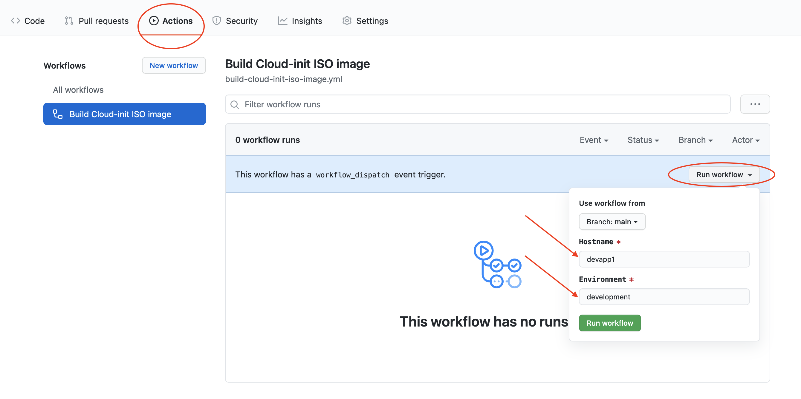

# Introduction
This project aims to explain how to automatically provision Ubuntu hosts using a USB Stick for those environments where PXE or other services like a web server are not available.

It is recommended to fork this project, so GitHub Actions Pipeline will be available to you.

The configuration for each specific host is stored in the repository, so any change is under version control and via a Pipeline the specific image for each host is created.

During the following steps, you will get to know Ubuntu "Autoinstall", Cloud-init nocloud datasource, how to store your configurations and how to tested in a VirtualBox nor a bare metal.

# Ubuntu "Autoinstall" Installation
Ubuntu provides multiple systems to automate installation. The legacy one is *debian-installer preseeding* a *preseeds* files which contains a set of answers for the different questions that appear during the manual installation.

This method is meant to be legacy and the current method is *Cloud-init* which is documented in [Ubuntu Autoinstall Documentation](https://ubuntu.com/server/docs/install/autoinstall).

## Cloud-init


Cloud-init is the industry standard multi-distribution method for cross-platform cloud instance initialization. It is supported across all major public cloud providers, provisioning systems for private cloud infrastructure, and bare-metal installations.

We can also provision bare metals on-premise using [nocloud](https://cloudinit.readthedocs.io/en/latest/topics/datasources/nocloud.html) datasource passing the configuration via a second USB Stick labeled as "cidata".

https://ubuntu.com/server/docs/install/autoinstall-quickstart

## Source control configurations
Inside of the `configs` directory:
```
configs
├── environments
│   ├── development
│   │   ├── devapp1.yaml
│   │   └── devapp2.yaml
│   └── production
│       ├── prodapp1.yaml
│       └── prodapp2.yaml
└── root_config.yaml
```

There are several .yaml files, e.g.:

`root_config.yaml` contains the general configuration, like the default user and ssh configuration, which will apply to all the provision hosts.

```
identity:
  hostname: ""
  password: "${DEFAULT_USER_PASSWORD}"
  username: "sysadmin"

(...)

ssh:
  install-server: yes
  allow-pw: no
  authorized-keys:
    - "${DEFAULT_USER_SSH_KEY}"
```

The files in `environments` directory e.g.: `environments/development/devapp2.yaml` contains the specific configuration for a specific host:

```
hostname: devapp2

ethernets:
  interface0:
    match:
      macaddress: "08:00:27:76:5C:C6"
    set-name: interface0
    addresses:
      - 10.0.2.15/24
    gateway4: 10.0.2.2
    nameservers:
      addresses:
        - "10.0.2.2"
```

The above configuration should work in VirtualBox, if you set in the network interface to have the mac address: `08:00:27:76:5C:C6` or you can use `devapp1` which just uses DHCP to assign the address.

## ISO Image creation via pipeline
For this demonstration, the following pipeline is available in [GitHub Actions](https://github.com/dlouvier/ubuntu-autoinstall-example/actions) but it can be implemented in any other CI/CD tool like Gitlab / Jenkins.

The configuration file is: `.github/workflows/build-cloud-init-iso-image.yml`.

In order to create the ISO image for the USB Stick to provision the host **devapp1** we just need to go to *Actions* in our repository and select our workflow. After that run, a manual workflow clicking in *Run workflow*. We will need to complete the fields `Hostname` and `Environment`.



After clicking in *Run workflow* the pipeline will start:


Once the job has been completed, we will be able to download the ISO Image from the Github Actions UI:


## Testing our ISO Image
Once we have the .zip file generated by GitHub actions we have two possibilities to test.

### Using VirtualBox
We will need to configure VirtualBox with two optics units and in the first one use the **Ubuntu 20.04** installation media and in the second one configure our just created ISO image.


After a few seconds, the installation will start and we will be able to see the automated installation of Ubuntu.


### Using a bare metal
For testing in real hardware, we will need to *burn* the ISO Image into a USB Stick. This depends on the OS you can use one of the following tools:

- Windows
https://rufus.ie/en/
- Linux: `dd` command. [HowTo](https://www.cyberciti.biz/faq/creating-a-bootable-ubuntu-usb-stick-on-a-debian-linux/)
- macOS: [BalenaEtcher](https://www.balena.io/etcher/)

After that, we need to plug both USB Sticks (one with the Ubuntu 20.04 media installation and another one with our configuration) to the bare metal and select the Ubuntu 20.04 USB Stick to boot.

The Ubuntu installation will detect the second USB Stick labeled as "cidata" and it it will start the installation.

### Notes
It is possible that the installation will prompt us to type "yes" to install Ubuntu using this procedure. The way to bypass this is to remaster the Ubuntu 20.04 installation to media to set `autoinstall` at the kernel boot options. Remastering is pretty straightforward using [Cubic](https://launchpad.net/cubic).
